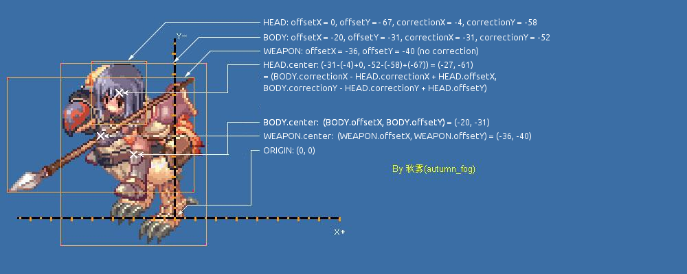

# ACT Format Specification

## Overview

ACT files store the animation data for all actions of an ingame entity, compiled as a single (binary) file. They're also used for static objects that are rendered using a spritesheet, i.e. anything that's rendered from an SPR file and not a regular image/BMP file.

They encode the following information:

* Available actions, such as "idle", "attack", "pickup" (looting an item), or "flinch" (getting hit)
* Animation frames, consisting of individual layers
* Sound effects (referenced), to be played during certain phases of the animation

Most notably, there are ACT files for items and even skill icons, which don't usually have an animation but still are assigned both an SPR and an ACT file regardless. Since there also exist regular bitmaps for them in the client files, I expect that these SPR/ACT files are only really needed for rendering equipment on characters, as well as lootable items in the game world (in short, anything part of the 3D environment).

Static skill or item icons displayed in the UI overlays could then simply use the actual images, which would make processing somewhat easier, though wasting disk space doesn't seem like something the developers would do if the other file formats are anything to go by.

While information from the SPR file is used to generate the actual bitmaps (images), the animation data allows the client to render objects in various phases of each animation, using the bitmaps contained in the SPR spritesheet.

Therefore the easiest way to think about ACT files is to simply consider them animation metadata, defining what images to display when and for how long for any given action. For static objects the only action then would be "idle", which means they aren't animated at all.

## Status

Mostly complete

## Open Questions

* Incomplete information on anchor points (they have an unknown field containing seemingly random data, not sure if it's actually used though)
* Are there more anchor points than one (players) or zero (creatures)? I've only seen these two, where the one existing anchor point refers to the body and is used to align the head, weapon, shield, headgear sprites. *Update: The file ``kagerou_male.act`` defines two anchor points, but they're both storing the exact same values. What is the point of this? Are there others? Can we safely ignore them?*
* Are the inconsistent frame timings ignored by the client? If they aren't overridden, visible glitches occur, so presumably they just messed up the data for some frames (e.g., compare the [timings for rogue_female.act](ACT_InconsistentFrameTimings.png ) ). *Update: I was able to render animations without these glitches by simply forcing all anchored sprites (i.e., head, weapon etc.) to always synchronize themselves with the current frame of the anchor (body sprite) before they're rendered in the scene. So the additional frames are simply skipped and unequal frame timings are ignored?*

I've been able to render sprite animations correctly, so I figured it'll do for now.

## Prerequisites

In order to understand the ACT file format, some familiarity with the following concepts is required:

* The [SPR](SPR.MD) file format, which is tightly coupled to the interpretation of ACT files
* Basic [animation techniques](https://en.wikipedia.org/wiki/Animation#Techniques) and how they can be used to animate sprites

## Layout

The file structure differs slightly with each file version, as newer versions added more features. Please consult the tables below for a detailed specification.

It appears that (similar to SPR files) the header encodes the version in reverse, i.e. ``41 43 05 02`` reads as ``AC 5.2`` but it's actually version 2.5 and not 5.2.

The following versions are said to exist:

* 0x101 (to be confirmed)
* 0x200 (to be confirmed)
* 0x201 (to be confirmed)
* 0x203 (to be confirmed)
* 0x204 (to be confirmed)
* 0x205 (confirmed)

### Version 0x205

| Field | Bytes | Type | Description |
| ---- | ---- | ---- | ---- |
| Header | 2 | char | 'AC' |
| Version | 2 | uint | 0x205, 0x204, 0x203, 0x202, 0x201, 0x200 |
| nActions | 2 | uint | The number of [Actions](#action-layout) in this ACT file. |
| Reserved | 10 | 10*byte | Reserved, unused bytes. |
| <actions\> | variable | [Action](#action-layout) | times * nActions read [Action](#action-layout) part below. |
| nEvents | 4 | uint | The number of [Events](#event-layout) (e.g. sounds) this ACT file has. |
| <events\> | variable | [Event](#event-layout) | times * nEvents read [Event](#event-layout) part below. |
| Intervals | 4 * nActions | float | Interval for each [Action](#action-layout). First float corresponds to the first action, second float to the second action, etc. |

### Action layout
| Field | Bytes | Type | Description |
| --- | --- | --- | --- |
| nFrames | 4 | uint | The number of [Frames](#frame-layout) in this Action. |
| <frames\> | variable | [Frame](#frame-layout) | times * nFrames read the [Frame](#frame-layout) part below. |

### Frame layout
| Field | Bytes | Type | Description |
| --- | --- | --- | --- |
| Range1 | 16 | 4*uint | Left, top, right, bottom. In that order. Seems to be unused. Commented with "Attack range". |
| Range2 | 16 | 4*uint | Left, top, right, bottom. In that order. Seems to be unused. Commented with "Fit range". |
| nLayers | 4 | uint | The number of [Layers](#layer-layout) used in this Frame. |
| <layers\> | variable | [Layer](#layer-layout) | times * nLayers read [Layer](#layer-layout) part below. |
| EventId | 4 | int | Id of the [Event](#event-layout) that this frame fires. |
| nAnchorPoints | 4 | uint | The number of [AnchorPoints](#anchorpoint-layout) this Sprite uses. |
| <anchorpoints\> | variable | [AnchorPoint](#anchorpoint-layout) | times * nAnchorPoints read [AnchorPoint](#anchorpoint-layout) part below. |

### Layer layout
| Field | Bytes | Type | Description |
| --- | --- | --- | --- |
| X | 4 | int | The x coordinate of the layer.  |
| Y | 4 | int | The y coordinate of the layer. |
| SprNo | 4 | int | The sprite number used (this references the sprite inside a SPR file). |
| Flags | 4 | uint | Bitflags. So far only first bit is used to indicate whether the layer should be mirrored on the y-Axis. |
| Color | 4 | 4*ubyte | In the order: red, green, blue, alpha. Each color is one byte. This is the tint of this layer. |
| XScale | 4 | float | The scale factor for the width of the layer. Below version 0x204 this is also the scale factor for the height (yScale). |
| YScale | 4 | float | The scale factor for the height of the layer. |
| Rotation | 4 | float | The rotation of the layer around its center in angle degrees. |
| SprType | 4 | int | The type of the sprite used from SPR. 0 == Palette sprite, 1 == RGBA sprite. | 
| Width | 4 | int | The width of the layer. Assumingly always the same as the referenced sprite width in the SPR file. |
| Height | 4 | int | The height of the layer. Assumingly always the same as the referenced sprite height in the SPR file. |

### AnchorPoint layout
| Field | Bytes | Type | Description |
| --- | --- | --- | --- |
| Unknown | 4 | 4*byte | Unknown bytes. When parsing the ACT file 16 bytes will be read from the buffer directly into a *class* (not struct) that holds the three members x, y and attr. Funny that this actually works. |
| X | 4 | int | Offset x coordinate of this anchor point. |
| Y | 4 | int | Offset y coordinate of this anchor point. |
| Attr | 4 | int | Apparently this value is used to compare against another anchor point when stitching together the separate sprites (e.g. body and head). However, only the first anchor point of each sprite is used for the comparison. For that to work it implies that this value is always the same (in this case 0). |

### Event layout
| Field | Bytes | Type | Description |
| --- | --- | --- | --- |
| Name | 40 | 40*char | The null-terminated string name of the event (e.g. "atk" or some sound file). |

**TODO: Add file layouts for the different versions.**

I have yet to find any version other than just 2.5 to research them.

## Actions

Each action represents an activity the ingame entity (monster, player, homunculus, NPC) can perform. To be precise, it represents an action that can be *animated*; it's perfectly possible to have entities perform actions that *can't* be animated, as is evident by immobile monsters, such as plants, mushrooms or Pupa, attacking players and even moving without having a proper animation.

This is usually the result of a glitch or explicit serverside scripting forcing this behaviour and quite clearly unintended. However, in general the different entity types have animations for all of the relevant ingame actions.

Some ACT files contained in the client have glitched animations, e.g. they are too slow, have missing frames, or contain incomplete and unused actions. (**TODO: Examples/screenshots?**)

For example, there exists a "crying" animation for Rocker and an animation where Fabre is morphing into a Pupa. These can never seen ingame without modifying the client and possibly the server, too.

### Player Characters

The following animated actions have been observed:

* Idle
* Walking
* Sitting
* Picking up an item
* Standby (used after combat)
* Casting
* Attacking, in three different flavours (unarmed/armed with different weapon types)
* Two "frozen" animations (in combat, standing)
* A flinch (getting hit/taking damage) animation
* One featuring the player dead on the floor

### Monsters

The following animated actions have been observed:

* Idle
* Walking
* Attacking, in three different flavours (unarmed/armed with different weapon types)
* A flinch (getting hit/taking damage) animation
* One featuring the monster dying

Additionally, some monsters feature other animations, most of which I've never really seen ingame.

### Homunculi

They use the same animations as monsters, but (usually?) come with three attack animations that are probably used for the different skills? (**TODO: Confirm**)

### NPCs

They are usually static, though there's at least one (unused?) Kafra NPC that also has a walking animation.

### Item and Spell Icons

They are completely static, and their "standing" animation is an image that never changes. Some appear to have copy/pasted their standing animation into other actions, but clearly they weren't intended to actually be animated.

### Shadow

As item and spell icons the shadow underneath the players/npcs/monsters and whatnot consists of just one action and frame.

## Frames

Each animatable action consists of frames. A frame defines the actual animation, and consists of a number of *layers* as well as the animation delay and optionally a sound effect.

The animation for a unit's current action will proceed to play these frames with the given animationDelay from first to last, playing any sound effect for the given frame. only one can be played and subsequent sound effects would override those already playing.

The delay is given in units of 25ms each, so an animationDelay of 1 means 25ms in between each frame. A sound effect index of -1 means that there is no sound. Otherwise, the index refers to a sound file listed in the ACT, which is loaded separately and not part of the file itself.

Depending on the type of action, frames can be repeated. Standing, standby or walking animations are always looping, while attack, cast and dying (for monsters) are not. Frozen/dead animations could be implemented either way, as it doesn't make any difference.

## Layers

A layer is essentially the metadata defining each individual sprite instance, and multiple can be stacked on top of each other to generate complex effects. Most animations feature only a small number, or even just one, but casting effects often can assemble many smaller effects also contained in the SPR spritesheet to form advanced visual effects.

The information contained tells the client what part of the spritesheet to display, how to scale or position it, tint or mirror it, and may even rotate the image. It's probably easiest to see for yourself how they work using Tokei's GRF Editor or ActEditor.

### Invalid (unused) layers

It can be observed that some sprites seem to contain "empty" layers, which might be leftovers from an earlier version of the game, or were left in there for some other reason. These layers reference sprites with index ``-1``. These are presumably skipped by the client and not rendered, nor animated, in any way.

Example: [ACT_EmptyLayersExample.png](Images/ACT_EmptyLayersExample.png)

In the head sprite for male characters, the first layer appears to be an invisible copy of the second. I've not found any information as to the purpose of this, but it doesn't appear to be relevant to rendering the sprites correctly.

## Animation Events

ACT files also contain information about special events that can take place whenever the respective animation frame is rendered. There are at least the following types of animation events:

* Audio playback (indicated by the name of a sound effect file)
* Display damage numbers (indicated by a virtual ``atk`` event)

If the damage numbers aren't explicitly triggered during any animation frame, they're displayed at the very end of the animation sequence. This seems like an error state/fallback, and can be seen in the attack animation of Dark Illusion, which is clearly somewhat broken.

### Sound Effects

As mentioned above, playing multiple sound effects in a row will cut off those already playing. This means that idle frames are needed to play sounds without animations if a longer sound is desired and there aren't enough frames otherwise.

Apparently, headgear sprites cannot contain sound effects and the client will just ignore them if added manually?

## Scaling and you - 3D vs. 2D rendering layers

The following quotes summarize the issue with scaling sprites in the client:

> The original client does not seem to support the operations (scaling and rotation) inside the act format when the sprite is being projected onto a window. So if he scales the sprite images up and reduces the size inside the act format, all sprite images in the login interface (which might not be important) and others (equip window, skill window, etc.) will have huge sizes.

> This is why changing the ACT file to use upscaled sprites in Gravity's client inevitably causes the equipment/talent tree UI to display a vastly oversized sprite. Unfortunately, this cannot be easily "fixed" given the technological limitations.

Essentially, there are two different layers with different technical limitations:

* The 2D UI layer, which does not implement sprite scaling
* The 3D layer, which supports scaling (based on each layer's scaleU/V properties)

The 2D layer contains all interface frames and therefore also item icons displayed in the player's inventory, as well as the character preview in the equipment and talent tree windows.

The 3D layer contains all sprites seen in the game world, as well as items dropped to the floor (which also live as entities in the game world). I believe it also includes all effects, even those that are basically sprites and purely 2D.

## ACT vs IMF (char select window)

The character selection screen appears to be even weirder; it's not really on the UI layer and therefore seems to use special files in the IMF format to display sprites.

This is probably an artifact of some weird design remnant of the early alpha/Arcturus times, so I wouldn't worry about replicating or even fixing this.


## SpriteTypes

So far, there are two sprite types being used in an ACT which correspond to the type of the spritesheet image (SPR file): Indexed palette/BMP (type 0) and RGBA/TGA (type 1).

Each spriteType uses their own sprite numbering. Means if you wish to use the third palette sprite of a SPR you would set the spriteType to 0 and the sprite number to 2. Respectively if you wish to use the third RGBA sprite you would set the spriteType to 1 and the sprite number to 2.

Technically the spriteType is not a true/false flag indicating whether the image is of indexed palette or RGBA nature. But instead is used as an index to refer to the underlying images of a SPR. It would be possible to simply add another type and give it the value 3 (the official client would obviously either crash or ignore it).

## Attachments

This is where the fun begins! As you may be aware, character sprites consist of different parts, like head, headgear, body, weapon, shield, cart, and they're all different sprites and therefore stored in different ACT/SPR files.

How the client stitches these together is very much akin to Frankenstein's monstrosity, and there are layering issues to be considered, too.

### Draw Layers

The weapon sprites, for example, must be drawn behind or before the body based on the character's direction.

Depending on the type of sprite (players, monsters, npc, etc.) different draw layers will be used. The most complex one being the players sprite. It uses the following layers:

`Shadow`, `Body`, `Head`, `Lower Headgear`, `Middle Headgear`, `Top Headgear`, `Weapon`, `Weapon Slash`, `Shield` and `Garment`.

The draw order mostly depends on the current direction of the player which can be divided into two parts. Either the player is facing "top left" depicted as an 'x' or "bottom right" depicted as an 'o':
```
x  x  x  
 \ | /       
x -¤- o
 / | \
o  o  o
```
The draw order might look like this then:

| Order | Top Left        | Bottom Right    |
|-------|-----------------|-----------------|
| 0     | Shadow          | Shadow          |
| *x*   | *Garment*       | *Garment*       |
| 1     | Shield          | Body            |
| 2     | Body            | Head            |
| 3     | Head            | Lower Headgear  |
| 4     | Lower Headgear  | Middle Headgear |
| 5     | Middle Headgear | Upper Headgear  |
| 6     | Upper Headgear  | Weapon Slash    |
| 7     | Weapon Slash    | Weapon          |
| 8     | Weapon          | Shield          |
| *x*   | *Garment*       | *Garment*       |

In this example, higher draw layers will be drawn over lower ones.
The body and head sprites might be reversed depending on the actual direction (not just the two divided parts). That value is read from the associated IMF file. The Garment layer takes a special place because its order might change on a per frame basis. It is either drawn as the first sprite directly after the shadow (beneath everything) or as the last sprite (on top of everything). The order for the garment is read from the lua file `_New_2DLayerDir_F.lub` or `2dlayerdir_f.lub`.

**TODO: What about 2D and 3D effects, the combat log (text plane)?**

These layers also interact with the game world, and avoiding clipping issues is in fact very difficult (or even impossible), depending on the camera's position. I assume this is why they fixated the camera angles, as you can clearly see the sprites being warped when modifiying it beyond what they originally intended.

**TODO: Screenshot and more details, approaches to circumventing it (override shader, forced draw layer priorization, possibly others?)**

### Anchor Points

ACT files for player characters, as well as those for equipment worn by players, contain special information used to anchor sprites of arbitrary sizes together so that they fit perfectly. This is the needle and thread of the stitched abomination they created and it truly was a pain to get right, but it's of crucial importance.

Monster sprites and items don't appear to be containing anchor points, though I've not done an exhaustive search to be sure.

The exact calculation is clearly convoluted, and I only found one source giving more details on this. I have translated the picture they gave here from the Chinese original, with a little help from a friendly Redditor:



#### Example: Visualization of Anchor Points

In order to really understand this concept, it's probably easiest to just see it in action. As an example, I made a [(very short) visualization video](Videos/ACT_AnchorPointsVisualization.mkv).

In it you will see three anchor points, represented by the three squares positioned with their center directly on the anchor point that is implied by the offsets stored in the ACT file.

The blue one is the sprite's origin, meaning the center of the tile where the unit itself is positioned in the game world. It's the same for both body and head because both are part of the same unit. If you ignore anchor points completely, this is also where the center of the body and the head itself would be rendered, but then the head, equipment etc. will of course look very wrong.

The interesting parts are magenta and yellow: The yellow square is the body's anchor point, as defined in its ACT file, while the magenta one is taken from the head's ACT file. The head sprite is placed exactly in between those two and relocated at every frame, which gives the illusion of both parts being one sprite as they're moving in unison.

You can hopefully see that the center of the head (which is its position in 2D and 3D coordinates) is the point in between the two squares, calculated by simply subtracting them and obtaining the mathematical displacement. Coincidentally (or not), this is exactly what the image above explained, albeit in a more realistic environment.

You can additionally see an arrow depicting the direction the unit is facing in, and the red cube is simply a bounding box placed on the tile the unit is located at, though these aren't immediately relevant to the understanding of anchor points.

#### Calculations

Calculating the transformation from 2D to 3D space for any two given anchor points is a little tricky. For example, taking the frame's anchor point (for the head sprite ``1_male.act``) defined by

    offsetU = 2
	offsetV = -23

we have to do the following:

1. Invert the ``Y`` axis (here labelled ``V`` axis, since we're working in 2D space)
2. Translate the pixel coordinates of all the added offsets (body minus head plus displacement, as picture above) into world coordinates, by mapping it to whatever scaling factor is used. This factor is given in pixels per world unit, which I *think* might be 32 (purely based on the size of the tile selector image, ``grid.tga``)
3. Find the origin of the unit represented by the sprite, in 3D world coordinates (XYZ)
4. Calculate the translation of those two dimensions (UV) in 3D space (XYZ), according to the formulae given in the picture above. This usually involves projecting the two UV unit bases ``(1, 0, 0)`` and ``(0, 1, 0)`` to 3D via the camera's view matrix and then scaling them by the amount calculated from all the offsets, in step 2, resulting in the sprite plane's actual 3D transformation that will be perceived as "moving on the UV axis" by the viewer
5. Translate the origin to the so-calculated anchor point, by simply adding the two

Since this is somewhat complicated, I'll omit further details, but you can contact me or look at the code I wrote if you need to understand the algorithm better.

#### /doridori and "look directions"

There's one more stumbling block, and it's the fact that player characters in RO can not only have a "face direction"(as visualized by the arrow in the above video), but also a "look direction". This is the direction that the character's *head** is "looking" in, and it doesn't affect the actual face direction, which DOES have implications in the game world, like Backstab not being able to be used on targets that are facing towards you.

Most notably, you can type /doridori to change your character's look direction, and SHIFT-clicking in the correct pose will alter it without affecting the face direction. Only the STANDING and SITTING poses support look directions, and if you SHIFT-CLICK in any other pose your character will simply change its face direction.

Generally, a player's look direction is equal to its face direction unless manually changed by the above. If interpreted in angles, the look direction consists of three points on a semi-circle (180 degree field of view) representing LEFT, FORWARD, and RIGHT, but face directions are defined by eight points in a full circle (360 degree), with increments of 45 degree and usually sprites having only 2 poses per side which are mirrored and change in increments of 90 degree.

The solution is to fixate the frame index to 0 (looking forward) used by the head sprite if a unit is currently STANDING or SITTING, and to set it to the look direction (1 or 2 for left and right, respectively) otherwise.

*Update: This only works if the animation pose consists of 3 frames. I've now found some headgears that are animated with 27 frames, where 9 frames are used per look direction rather than just one. This means that the calculation will be more complex and needs to take into account the maximum frame index, dividing it by three (the number of look directions), or so I believe.*
