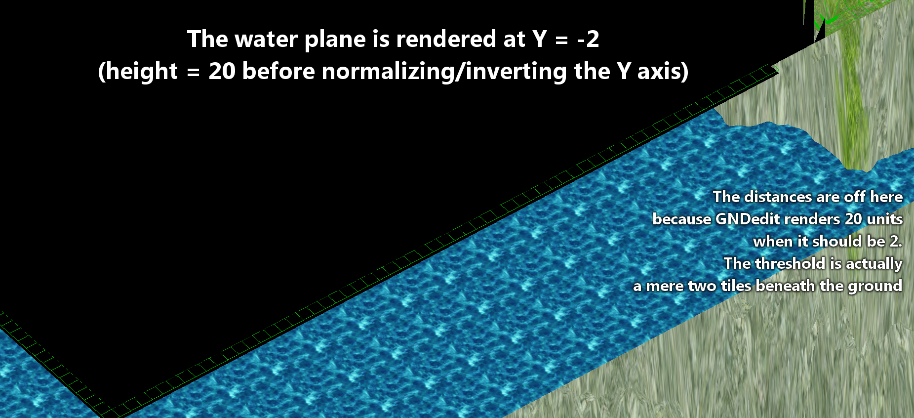

# GAT Format Specification

## Overview

GAT files contain two pieces of information: The altitude data (as height vectors) for each tile of a map, and the terrain type that represents the terrain on a given tile.

The contents can be interpreted as a navigation map that is used by both client and server in pathfinding algorithms, to determine the legality of movements, and line of sight checks.

## Prerequisites

GAT files are inherently simple and do not require much in the way of previous knowledge, or at least none that would be specific to them.

## Tiles

Tiles are the elementary building block of RO terrain. In the GAT files, each tile for the map is defined by the following properties:

* Four height vectors defining the height at each of the four corners
* A flag indicating the terrain type, used to determine terrain attributes

Tiles are arranged from bottom-left to top-right.

### Height Vectors

Thei corners of each tiles are adjusted via the altitude parameters (height vectors) to realise many different slope variations.

#### Interpreting Height Vectors

It should be noted that the height vectors in both GND and GAT files are given in the client's (very much unintuitive) coordinate system; this means the values are actually negative and scaled. They should be interpreted as "value on the negative Y axis multiplied by the global GAT zoom level" (see next section).

The distance between each corner defined by the height vector is defined by the geometry's scale factor. The heights themselves also have to be interpreted to account for this fact, lest you get very odd results indeed:

In this screenshot, we can see that the creator of GNDEdit correctly calculated the positions of tiles and cubes, but somehow forgot to normalize the height vectors, resulting in terrain that appears visibly "stretched".

You'd have to either do what Gravity did and use a consistent scale factor for everything to keep things in proportion, or do what any sane person would do and normalize all coordinates to a basis of one world unit (sigh).

#### Texture Mapping and Geometry Scaling

Similar to the geometry scale factor stored in the map's GND file, interpreting GAT files also requires a "zoom" level (scale factor), which can be used to convert from map to world coordinates (and vice versa). See [GND specification](GND.MD) for more details on this.

However, this value is hardcoded in the client rather than included in the GAT file itself, and set to be ``5`` for all maps, meaning that each tile is five world units large. Since GND cubes are usually 10 world units large, this merely means that the ratio of tiles to cubes is fixed, i.e. "each cube contains exactly two tiles".

As far as I know, the textures used are always 256 x 256 pixels wide, from which a 64x64px slice is mapped to each cube and consequently, a 32x32px slice is mapped to each tile. Comparing this to the tile selector image seems to confirm this fact, and we find it is exactly 32x32 pixels large.

### Terrain Types

Each tile comes with a "tile flag" that determines the type of terrain that the tile is intended to represent. These flags are used to create a simplistic simulation of the different terrains that can be found in the game world, and should be interpreted as follows:

| Value | Walkable |             Interpretation             |
| :---: | :------: | :------------------------------------: |
|   0   |   YES    |            Walkable terrain            |
|   1   |    NO    |    Obstructed (impassable) terrain     |
|   5   |    NO    | Impassable snipeable terrain ("cliff") |

There are other flags, as detailed in numerous online sources, but these don't seem to have any relevance to the client's interpretation. They are most certainly used by the zone server to determine illegal game states and therefore must be supplied as a "map cache" file in the Hercules/athena emulators, but I haven't looked into them more.

From what I've seen, the client seemingly ignores the terrain type itself and instead only cares about whether or not the tile is "walkable" or "obstructed" (impassable or cliff). Consequently, the only types that the server can inform the client about are ``0``, ``1`` and ``5`` (or walkable, obstructed and snipeable/cliff, respectively).

This is also reflected in the client's pathfinding routines, where the latter two types are considered impassable, though no heed is paid to whether or not a tile counts as "water" or not. More research is needed as to what is the exact behaviour on the serverside, presumably.

## Layout

### Version 1.2

Just one version (1.2) is used in the modern RO client and there appears to be no support for any other version either.

|  Field  | Offset |   Size   |  Type  |                        Description and notes                        |
| :-----: | :----: | :------: | :----: | :-----------------------------------------------------------------: |
| Header  |   0    | 4 Bytes  |  int   |                  "GRAT" as an ASCII-encoded string                  |
| Version |   4    | 2 Bytes  | binary |                Versioning information (Major.Minor)                 |
|  Width  |   6    | 4 Bytes  |  int   |     The horizontal dimensions of the map (maximum X coordinate)     |
| Height  |   10   | 4 Bytes  |  int   |      The vertical dimensions of the map (maximum Z coordinate)      |
|  Tiles  |  14+   | 20 Bytes | struct | The given size is per tile (see below for details about the layout) |

Each entry in the ``Tiles`` section represents a block (tile) of the given map, and is structured as follows:

|   Field    | Offset | Size  |  Type  |                           Description and notes                           |
| :--------: | :----: | :---: | :----: | :-----------------------------------------------------------------------: |
|  Altitude  |   0    |   4   | float  | Altitude at the bottom left corner, i.e., at (0, 0) relative coordinates  |
|  Altitude  |   4    |   4   | float  | Altitude at the bottom right corner, i.e., at (X, 0) relative coordinates |
|  Altitude  |   8    |   4   | float  |   Altitude at the top left corner, i.e., at (0, Z) relative coordinates   |
|  Altitude  |   12   |   4   | float  |  Altitude at the top right corner, i.e., at (X, Z) relative coordinates   |
| Terrain Type |   16   |   4   | uint32 | Used to determine walkable/snipable properties |

Only the low word of the terrain type field is actually used, so the rest appears to be irrelevant garbage data. The "32-bit unsigned integer" is therefore misleading, because there's really only a few terrain types (tile flags) that the client actually supports.

### Version 1.3

This version is almost identical to the previous one, but it changes the terrain type field of each tile: Whenever the high byte of the value is ``0x0080`` (``128`` if interpreted as an unsigned 8-byte integer), the tile is marked as a "water tile". The low byte is still the same as before and defines obstructed tiles.

What exactly the effect of this is in the client isn't quite clear, but it looks like it simply marks the intersection area of the ground mesh and the water plane(s)?

More research is needed since this format was recently introduced in kRO and isn't available to me (for proper testing) at this time, as the emulators don't appear to support the latest client versions yet.
