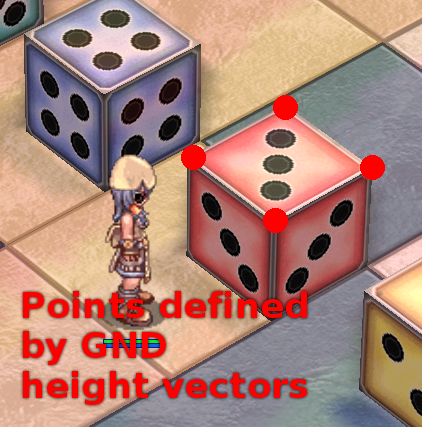
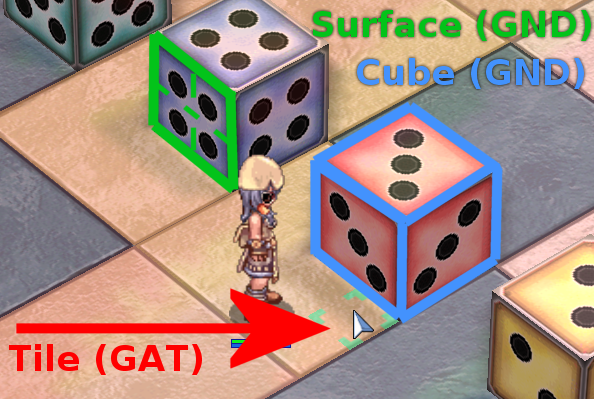
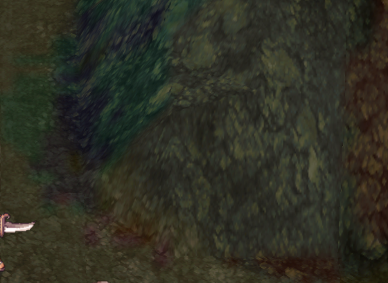
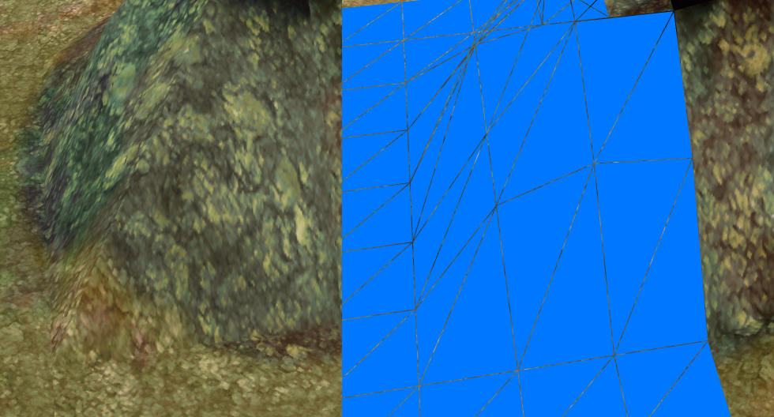
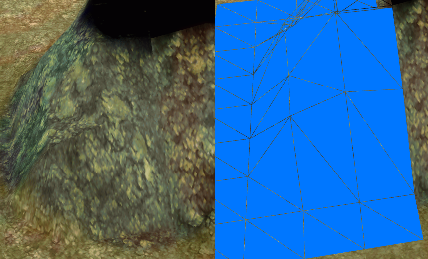

# GND Format Specification

## Overview

GND files contain the entirety of a map's static geometry (i.e., the ground/terrain). It doesn't include objects and the water plane, which are stored as part of the RSW file instead.

## Prerequisites

In order to understand the GND file format, some familiarity with the following concepts is required:

* The [GAT](GAT.MD) specification, as it closely ties into how the GND file is interpreted
* [Polygon meshes](https://en.wikipedia.org/wiki/Polygon_mesh), used to represent objects in 3D space
* [Lightmaps](https://en.wikipedia.org/wiki/Lightmap), a standard way to use precomputed lighting and improve rendering performance
* [Posterization](https://en.wikipedia.org/wiki/Posterization), an effect of reducing the number of colors which is applied to the lightmap texture

## Ground Mesh

The ground mesh is a static object that represents the ground (or terrain) of each map. It is the defining part of the GND file and consists chiefly of geometry to which diffuse textures, color highlights and lightmap textures are applied.

## Relationship between GAT and GND

Both files are defining different parts of a map's geometry. See also the following quote:

> What you can take away from the RO method, is that they actually use two heightmaps: one invisible heightmap used for collision detection, and a visible one used to draw the map. That way, they can extend the "invisible wall or platforms" around various objects (eg those boats or docks placed in the scene that are not part of the heightmap

*Source: [Game Development @ StackExchange](https://gamedev.stackexchange.com/questions/25823/how-to-create-a-3d-world-with-2d-sprites-similar-to-ragnorak-online)*

The "collision map" is basically the contents of the GAT file (terrain types and "walkable" flags), while the "height map" is chiefly equivalent to the ground mesh as defined by its height vectors. The server needs to have the GAT information but doesn't care about GND, while the client uses the GAT to place units at their correct height and the GND to render the terrain geometry itself.

### Reconstruction

Recreating the terrain involves a complex set of operations; It is stored in a memory-efficient format and therefore not directly compatible with how modern rendering hardware expects 3D objects to be described (see [Face-Vertex Mesh](https://en.wikipedia.org/wiki/Polygon_mesh#Face-vertex_meshes)).

Instead of storing the vertex data directly, individual chunks of terrain ("cubes") are implicitly defined by the "height values" that are effectively defining the upwards-facing surface geometry by giving the relative position of its corners, offset by the surface cube's position in an imaginary "grid" of cubes.

To better explain how the geometry can be reconstructed, it might be helpful to view it as a combination of different (simpler) primitive shapes that are  "stitched together" to form the ground mesh.

#### Tiles, Cubes, and Surfaces (Oh my!)

RO uses tiles as the basic unit of measurement for game logic, but its world actually consists of surfaces larger than that, which are part of what you could call "cubes" (boxes). These boxes are combined like a jigsaw puzzle to form the actual terrain.

Cubes are defined by only three surfaces (TOP, NORTH, EAST), which can be one of the two types mentioned below. In order to realize the BOTTOM, SOUTH and WEST sides, the adjacent cube's TOP, NORTH and EAST surface are used, respectively. The only two types of surfaces are GROUND and WALL, where GROUND is essentially the square defined by connecting the four height vectors stored in the GND file, and WALLS are the implied surfaces formed by connecting the GROUND surface of one cube to the GROUND surface of the neighboring cube, forming what a wall if they differ in height.

Each surface of a cube is 2x2 GAT tiles large and may be textured or not. Surfaces without textures (i.e., texture ID is ``-1``) aren't rendered, nor can they be used to attach "wall" surfaces to from their adjacent cube. This is relevant, because in at least two instances, namely ``c_tower4`` and ``juperos_01``, ground surfaces on the map boundaries are erroneously assigned EAST and NORTH surfaces, but you can't render walls on map boundaries since there's no vertices that you could connect with.

There's no direct reference to the tiles as defined in the world coordinate system, but rather surfaces/cubes are combined in a predefined order (bottom/left to top/right, with new rows starting whenever the "map width" has been exceeded - very much like pixels in a bitmap image).

Since this process is somewhat convoluted, more details are given below.

Also, here's an amazing elementary-school-level illustration of the above concepts:

*Pictured: The height values from the GND file's cube grid define a set of height vectors for each cube.*

These then have to be turned into an equivalent representation of the actual geometry:

*Any surfaces and cubes that are implicitly defined by the height vectors can easily be reconstructed.*

The green tile selector cursor here serves as a comparison for the dimensions; as mentioned above, each surface takes up the space of two GAT tiles. Wall surfaces may often appear bigger, but from what I can tell they're still mapped just the same and appear stretched if they happen to be larger.

##### Tiles

As previously mentioned, [tiles](https://en.wikipedia.org/wiki/Tile) are the basic building block for the terrain, so in a way RO could be described as a [tile-based game](https://en.wikipedia.org/wiki/Tile-based_game). It's not technically accurate, but that's definitely how the end result is perceived. Characters are positioned (at the center) on a tile, map coordinates refer to the tile and everything that requires thinking about positions usually works with the tile as the smallest unit... except when it comes to rendering.

In practical terms, the actual size of each tile, as rendered on the screen, depends on the scale of the world, camera zoom level and screen resolution. However, it's the baseline for measuring distance in the world coordinate system, where one unit of distance can be expressed in "number of tiles".

As far as textures are concerned, a texture appears to fit on a single tile if its dimensions are 32 pixels, as can easily be seen by checking the size of the ["grid selector"](https://i.imgur.com/GBuVjXe.png) texture rendered on top of the currently selected tile.

##### Surfaces

Surfaces are the visible areas containing tiles. The entirety of the map's geometry is made out of surfaces, which can be textured or "invisible" and as far as I can tell, each surface contains exactly four tiles (two in each dimension).

This is mostly of relevance for texturing, since texture slices usually are 64 pixels wide, so larger surfaces that appear seamless in the game are frequently pieced together by individual surfaces to give the appearance of a continuous textured plane (and they're indeed rendered similarly). Unfortunately this can cause problems if texture coordinates aren't applied correctly (and sometimes even if they are), which is why there are visible "gaps" in the terrain that can be seen at the right camera angle and distance.

The vertices forming the terrain's surface geometry must be connected from bottom-right to top-left for each textured surface. If done the other way around some slopes will look very wrong.

This beautiful part of early 2000s wall geometry can be found at approximately ``pay_dun00 (40, 35)``:

Connecting the vertices the wrong way (bottom-left to top-right) results in a horrible disfigurement:

Clearly, the makers of this cave did not intend for things to go so horribly wrong!

Luckily, connecting them the other way around immediately eliminates the problem:

For comparison, here's the original rendition once more:

So remember kids, always draw your triangles the right way... or someone will be very sad when they see the result.

##### Cubes

Generally speaking, the terrain is defined by a heightmap indicating the positions of all four corners for any given tile. Each chunk of the heightmap (2x2 tiles) is sometimes called cube, which implies the presence of up to 6 surfaces: Two for the top and bottom of the cube, two to either side, and two to the front and back, where of course any number of them could be missing.

Now, the reason the cube metaphor doesn't work perfectly is that each chunk is only defined by *three* surfaces at most: Top, north, and east. If interpreted as surfaces it doesn't really change anything; Since you can express a cube's left (or south)-facing side as the adjacent cube's right (or north)-facing side you get the same effect with a much smaller data structure.

[This visualization](Images/GND_SurfacesVisualization.png) might help understand the implications. In the picture, surfaces are colored as follows:

* Green if they're the TOP surface for a given cube
* Blue if they're NORTH (wall surfaces)
* Red if they're EAST (wall surfaces)

What this means is that, counter to intuition, the blue parts to the south of each chunk aren't really the south surface of the respective ground cube, but rather the north one of the neighbouring cube to the south. The "walls" are implicitly defined by the difference in both cubes' height vector and the client renders them according to which of the top surface is higher, or not at all if the surface's aren't textured.

A side effect is that the northernmost "cubes" of each map can't have a "northern" wall, nor can the westernmost "cubes" have a wall to the west. This is why every single map has a specially-crafted "border" beyond the actual visible "walls" (if there are any), which are black impassable surface that are just sitting there and can't usually be seen in the game, as they blend in with the background.

In the GND files, you will merely find each corner's height and the overall scale factor, which is enough to render the geometry. You could do this by translating the positions to world coordinates and normalize the heights so they refer to a cube of width and height 1 (as in, "one unit in world coordinates"), or just make the cubes bigger to account for the scale factor and then "zoom out" farther to get the same perspective.

The geometry is then rendered by simply glueing all the surfaces together, and walls are implicitly formed by two tiles that aren't on the same height: If there's a height difference there'll be a plane in between the two tiles; this essentially becomes a "wall" if assigning it a texture. However, this is only done if the neighbouring "cube" is higher or lower and has a textured surface of its own.

### The Normalizing Scale Factor

Each entity in the game world is assigned a "zoom" factor that is used to calculate its rendered size on the screen. For objects of type "Ground", this is always initialized with the value ``10``. Starting at version 1.6, it is overwritten with whatever value is stored in the map's GND file.

Since I haven't seen any map that used a different "zoom level" for its terrain, I have to assume they just kept the default value.

The actual calculation appears to be as follows:

    normalizingScaleFactor = GND.mapDimensions / GAT.mapDimensions * GND.geometryScaleFactor

Since each GND surface normally measures two GAT tiles, and the scale factor is seemingly always set to ten, this nets:

    normalizingScaleFactor = 1/2 * 10 = 1/5

 Therefore a constant scale factor of ``1/5`` should be correct for every map. Applying this factor scales the heights given by the height vectors of the GND file back to the standard coordinate system, with one tile being one world unit large.
## Lightmaps

A lightmap is used to add static light and shadow detail to each map, without requiring the client to calculate lighting in real time.

Similarly to the terrain's surface itself, the lightmap texture is sliced into unique parts, and each part must be mapped to the right surface on the assembled ground mesh. [This screenshot](Images/GND_LightmapSlices.png) might give you an idea of what to expect.

The process is otherwise similar to how the actual terrain is formed: Each surface references a slice of the lightmap texture, as well as a part of the regular (diffuse) texture, while each cube references up to three surfaces.

### Buffer Areas and Texture Bleeding

The visible white borders in that screenshot bring us to another phenomenon: Texture bleeding. If all the tiny slices were to be combined seamlessly, there could be visible artifacts from texture bleeding.

To avoid this problem, there's a one-pixel area to the north and east of each texture slice that isn't used directly. It serves to provide a buffer between the adjacent slices and removes or at least reduces the effect when texture filtering is applied.

In [this example](Images/GND_AntiBleedingBufferArea.bmp) I have manually merged two adjacent slices. The green squares mark the borders of the visible portion of each slice, with the areas outside being the "buffer".

> Some devs are still wondering why their shadowmaps look a bit weird. The reason is plain simple:
A lightmap consists (most of the time) of 8x8 tiles, where only the 7x7 pixels in the center are used. Nothing new. However, the tiles are combined into
a large texture. If texture filtering is being applied, then the borders of the different textures interpolate into each other, fatal for colormaps when they
have different colors. This is called texture bleeding. Because of this, Gravity added a padding of 1 pixel to each tile (resulting in 8x8, instead of 7x7)
and filled them with colors that still look nice when they are interpolated.

### Light and Shadow

Lastly, there isn't a single lightmap texture, but rather two: A "color map" that contains static lighting, and a "shadow map" that contains only greyscale data and is used to render shadows.

Example: [Color map](Images/GND_UnwrappedColorMap.png) vs [Shadow map](Images/GND_UnwrappedShadowMap.png)

The "shadow map" must be applied after the lighting calculation to avoid having it blended in with the other light sources, which would cause shadows to appear "washed out" or even invisible, depending on when in the lighting process the colors are multiplied with the shadow/alpha values.

I believe the client might simply use the alpha channel directly and store both in just one texture, since there's just one texture stored in the GND file and the ``/lightmap`` command seems to disable both parts, but this is merely an educated guess.

### Posterization

The client reduces the number of colors when processing the lightmap texture, causing visible artifacts. These are not part of the lightmap itself, but rather introduced deliberately when loading the texture.

I can only speculate as to why such a  "feature" exists, but my guess would be technical limitations or a stylistic choice. Either way, it is possible to render lighting in the way it was originally computed using just the information that's part of the GND file. This smoothes the transition between colors, as can be seen in the following comparison:

* [Here](Images/GND_ColorMapOriginal.png) are the lights of Comodo in their original glory
* And [here](Images/GND_ColorMapPosterized.png) they are again after applying the posterization effect with a "posterization level" (see below) of ``16``

Note the jagged appearance that plays a huge part in giving RO maps their distinctive look.

The effect is achieved by applying the following operation to the RGB values:

    r = (int)(r / LEVEL_COUNT) * LEVEL_COUNT
    g = (int)(g / LEVEL_COUNT) * LEVEL_COUNT
    b = (int)(b / LEVEL_COUNT) * LEVEL_COUNT
    In RO, LEVEL_COUNT is 16.

    For javascript it would be c = floor(c / LEVEL_COUNT) * LEVEL_COUNT;
    where c is each color component

This effectively casts the color value from float to int, reducing the amount of visible colors and thereby introducing the "jagged" transitions in the color gradient.

## Diffuse Colors (AKA Vertex Colors)

In order to give highlights to the terrain without requiring vast amounts of slightly different textures, the client can render specific (solid) colors at the corners of each tile to give this corner (and all adjacent ones) a different hue.

This concept is known as [vertex colors](https://gamedev.stackexchange.com/questions/139059/what-is-a-vertex-color) and it works by submitting additional information for a given point in 3D space that is then used by the hardware/GPU software to color it differently. It was widely used in older games where dynamic lighting wasn't feasible due to technical limitations, and it can have a significant visual impact for barely any effort at all:

Again they massively saved on file size by providing only one color value per tile, which is applied to the bottom left corner (vertex) of each tile and the vertices of all adjacent tiles that happen to be in the same position. With this, one can define colored spots on the corners of the tile grid with very little effort or overhead.

In [this basic rendition of pay_dun00](https://i.imgur.com/HWrzkEE.png) you can see the textured terrain with vertex colors applied (lightmaps, models, etc. are not displayed). They're the "blotches" on the ground, which blend in with the rest of the scene after all other effects are applied and give the terrain a lot of variety while still using a very limited set of textures.

> Each tile can have a diffuse color. This color, however, is not being applied to all four corners of a tile, but only to the bottom left vertex and all vertices that share the same coordinate.
>
## Layout

### Alpha / Arcturus

At least one version exists that doesn't feature the typical GND header.

It seems to otherwise be largely identical to the later version 1.7, but I think it may use a different (simpler) lightmap format.

This is only an educated guess based on comparing the converted legacy GND files (author unknown) published on the athena forums.

### Version 1.7

This is the original version used in the modern RO client.

It contains all the basic information about the map's surface geometry, as well as information about the diffuse textures and lightmap/ambient occlusion textures.

| Field | Offset | Size | Type | Description and notes |
| :---: | :---: | :---: | :---: | :---: |
| Header | 0 | 4 Bytes | int | "GRGN" as an ASCII-encoded string
| Version | 4 | 2 Bytes | binary | Versioning information (Major.Minor)
| Width | 6 | 4 Bytes | int | Width of the cube grid
| Height | 8 | 4 Bytes | int | Height of the cube grid
| Scale | 12 | 4 Bytes | float | Geometry scale factor
| Texture Count | 16 | 4 Bytes | int | Number of diffuse texture paths
| Texture Path Length | 20 | 4 Bytes | int | Byte-length of each texture path string (always 80)
| Texture Paths | 24+ | 80 Bytes | string | Null-terminated (discard garbage bytes at the end)
| Lightmap Slices | variable | 268 Bytes | struct | Ambient occlusion and lightmap texture bitmaps (alternating)
| Surface Count | variable | 4 Bytes | int | Number of textured surface blueprints
| Surface Definitions | variable | 56 Bytes | struct | Shared texturing information (copy to each cube vertex)
| Ground Mesh Cubes | variable | 28 Bytes | struct | Width * Height entries

#### Lightmap Slices

There are two textures encoded in the files, one is a prebaked lightmap and the other a "shadowmap" (ambient occlusion map). They are read in that same order, based on the lightmap pixel format.

| Field | Offset | Size | Type | Description and notes |
| :---: | :---: | :---: | :---: | :---: |
| Lightmap Slice Count | 0 | 4 Bytes | int | Number of lightmap (and ambient occlusion) texture slices
| Pixel Format | 4 | 4 Bytes | struct | Encoding of the lightmap and ambient occlusion texture bitmaps (always 1 = 8-bit RGBA, stored as ARGB)
| Width | 8 | 4 Bytes | int | Width of each texture bitmap (always 8)
| Height | 12 | 4 Bytes | int | Height of teach texture bitmap (always 8)
| Shadowmap Pixels | 16 | 64 Bytes | bytes (array) | Width * Height ambient occlusion texture pixels (intensity values)
| Lightmap Pixels | 16 | 192 Bytes | bytes (array) | Width * Height lightmap texture pixels (specularity values)

#### Textured Surfaces

These are just the blueprints for creating the terrain geometry, and have to be applied (by copying over the texturing information) to the actual vertices implied by the ground mesh cubes.

| Field | Offset | Size | Type | Description and notes |
| :---: | :---: | :---: | :---: | :---: |
| Texture Coordinates | 0 | 32 Bytes | float | Diffuse texture UVs
| Texture ID | 32 | 4 Bytes | int | Index of the diffuse texture (``-1`` means "none")
| Lightmap Slice ID | 36 | 4 Bytes | int | Which lightmap (and ambient occlusion) texture bitmap to apply to the surface
| Vertex Color | 40 | 16 Bytes | byte | ARGB vertex color (stored as BGRA) for the surface's bottom left vertex

The texture coordinates are stored in order

1. ``bottomLeftU``
2. ``bottomRightU``
3. ``topLeftU``
4. ``topRightU``
5. ``bottomLeftV``
6. ``bottomRightV``
7. ``topLeftV``
8. ``topRightV``

where the direction is always relative to the cube that the surface belongs to.

#### Cube Grid

Please note that the dimensions are implied by the "width" and "height" given at the start of the file, and that they are different (half as big) as the actual map width and height given in GAT tiles. This is because each GND cube surface is 2 GAT tiles large, as described above.

| Field | Offset | Size | Type | Description and notes |
| :---: | :---: | :---: | :---: | :---: |
| Bottom left height | 0 | 4 Bytes | float | Altitude of the bottom left corner
| Bottom right height | 4 | 4 Bytes | float | Altitude of the bottom right corner
| Top left height | 8 | 4 Bytes | float | Altitude of the top left corner
| Top right height | 12 | 4 Bytes | float | Altitude of the top right corner
| Surface ID (TOP) | 16 | 4 Bytes | int | Upwards-facing surface ID
| Surface ID (NORTH) | 20 | 4 Bytes | int | Surface ID of the northwards-facing wall
| Surface ID (EAST) | 24 | 4 Bytes | int |Surface ID of the eastwards-facing wall

### Version 1.8

The water plane configuration that was previously part of the [RSW](RSW.MD) file has been removed from the RSW files and is now stored in the map's GND file instead.

All the information stored in version 1.7 is still present, plus the water plane configuration (appended).

#### Water Plane Configuration

In theory, the new GND format should support multiple water planes. In reality, all the maps that use it only feature one and are therefore indistinguishable from those using the old RSW format.

The reason is that a new version was introduced quickly afterwards, replacing 1.8 with a more elaborate version 1.9 that also supports this feature.

| Field | Offset | Size | Type | Description and notes |
| :---: | :---: | :---: | :---: | :---: |
| Water Level | 0 | 4 Bytes | float | Height of the default water plane (there's always at least one)
| Water Type | 4 | 4 Bytes | int | Texture ID applied to the water plane (tiled)
| Wave Height | 8 | 4 Bytes | float | Amplitude of the water plane's animation curve
| Wave Speed | 12 | 4 Bytes | float | Phase of the water plane's animation curve
| Wave Pitch | 16 | 4 Bytes | float | Surface curvature level (origin of the curve?)
| Texture Cycling Interval | 20 | 4 Bytes | int | After how many frames (or ms?) the next texture should be swapped in?

This is the basic water configuration, as present in both RSW (pre-2.6) and the next GND version. The configuration for the other planes follows after the above, and is (in this version) always of the following form:

1. ``numWaterPlanesU`` (int32): How many water planes there are in the horizontal dimension (always 1)
2. ``numWaterPlanesV`` (int32): How many water planes there are in the vertical dimension (always 1)
3. A float32 defining the ``waterLevel`` (altitude) of this plane. It's always identical to the water level above, since there is only one.

If there were multiple values here, it would likely be the water level of each plane (assuming the presence of ``u * v`` planes), but since that doesn't happen and there is already a new version it seems unlikely to ever occur in practice.

### Version 1.9

All the information stored in version 1.7, plus the water plane configuration (appended). The latter consists of the same information as is present in 1.8, but the format for defining multiple water planes has changed (and they are in fact used in some of the episode 19 maps I've seen, such as ``icecastle.gnd``):

1. ``numWaterPlanesU`` (int32): How many water planes there are in the horizontal dimension (*not* always 1)
2. ``numWaterPlanesV`` (int32): How many water planes there are in the vertical dimension (*not* always 1)
3. The same structure as defined for the original water plane (see table above), repeated ``u * v`` times

I'm not quite sure what the original configuration is still used for, but I'm guessing it would serve as a fallback in case the numbers (u, v) are both zero, i.e. there aren't any water planes defined in this section.

The individual water planes are placed in a grid of ``u * v`` cells, ordered just like the ground mesh cubes from bottom-left to top-right (in map coordinates). Each plane is exactly ``mapWidth / u`` wide and ``mapHeight / v`` high (all given in GAT coordinates), in combination covering the entire map. This is different from the situation where there's just a single plane, which would instead cover the entire map on its own.

## See also

* [This online demo](https://playground.babylonjs.com/#J48BT5#1) showing GND-style cube geometry defined in a standardized vertex data format (*Note: The triangles are formed bottom-right to top-left in the actual GND ground mesh and not bottom-left to top-right, as displayed here*)
