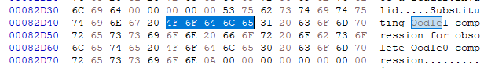

# GR2 Format Specification

GR2 files contain 3D models and skeletons stored in the proprietary [Granny3D](http://www.radgametools.com/granny.html) format.

This article only covers the files used in Gravity's RO client and does not aim to be a comprehensive resource for all possible variants and versions of Granny3D files.

## Prerequisites

Before learning about Granny3D files (as used in RO), you'll probably want to read this first:

* The (much simpler) [RSM](RSM.MD) format description, which uses keyframe 3D animations directly
* [Skeletal animation](https://en.wikipedia.org/wiki/Skeletal_animation), a technique for animating 3D models via "bones" and "weights"
* [B-Splines](https://en.wikipedia.org/wiki/B-spline#Computer-aided_design_and_computer_graphics), a way of compactly storing animation data as mathematical curves
* [Endianness](https://en.wikipedia.org/wiki/Endianness), a term that describes the architecture-dependant byte order of data
* [Marshalling](https://en.wikipedia.org/wiki/Marshalling_(computer_science)) can be employed to store data in an architecture-independent fashion
* [The Wikipedia article on Data Compression](https://en.wikipedia.org/wiki/Data_compression), for an intro to compression algoritms

## Overview

GR2 files are used very sparsely in RO, and appear to be a (failed) experiment that took place late in the game's development (2003): They are only used to represent WOE Guardians, the Emperium as seen during WOE, castle flags, and treasure boxes. They also contain an unfinished version of what looks to be a 3D player model (skeleton and textures only).

There are two "types" of Granny3D files used in RO: The model and idle pose of each 3D actor and can be found in files located in the ``data/model/3dmob`` directory, while the others each store a skeleton for another pose and are found in ``data/model/3dmob_bone``.

Unlike the custom formats used in RO, Granny3D files cannot as easily be deserialized. This is because they use a proprietary compression algorithm called [Oodle](http://www.radgametools.com/oodle.htm), which comes in many different versions and is (unfortunately) not widely supported by existing open-source tools.

Each Granny file encodes a hierarchy of objects and some metadata, with all data being stored in containers called sections. The compression is applied to (some of) the data sections, while the data stored inside, like textures and animations, can also be compressed (potentially using a different algorithm). This makes processing them somewhat difficult.

There are ways to get at the data, of course, but they generally rely on specific format conversion (such as a GR2-to-DAE converter that I've seen) or may not be fully compatible with all possible GR2 versions (various open source projects for other games come to mind).

## Features

Granny files can store arbitrary data, but in the case of RO they alway seem to follow a relatively primitive "standard" format. In particular, they don't appear to extend the basic Granny file format with custom data types. This means only some of the vast Granny3D feature set is used, the relevant portions of which should be described here.

### Mixed Marshalling

Going by what's been implemented in various open-source decompressor tools, the format allows storing data in an architecture-dependent form. This may necessitate a preprocessing step where it's updated for the current computer architecture (to restore the endianness).

It seems that this feature is indeed used by some of the files (e.g., ``aguardian90_8.gr2`` features 4 mixed marshalling blocks). I haven't looked into the specifics as OSS tools exist that will handle the de-marshalling process and I therefore consider it a "solved problem".

### Compression

The compression algorithm used for the compressed data sections is called Oodle0 and (from what I can tell) is an ancient, and almost certainly inferior, version of the same suite of compression algorithms still in use today.

In the compiled ``granny2.dll`` we find this string message that indicates it's now deprecated:

As far as the algorithm itself goes, the people at RAD have published many articles about their work on compression algorithms. Since I'm not an expert in data compression that, alongside some independent research, is the only source providing details about the design:

From what I can gather Oodle(0) uses [arithmetic coding]( https://en.wikipedia.org/wiki/Arithmetic_coding) with an [adaptive probabilistic model](https://en.wikipedia.org/wiki/Adaptive_coding) to predict the input stream while encoding, with the symbols being stored in a [Huffman-encoded](https://en.wikipedia.org/wiki/Huffman_coding) table. This means it's a variation on on the standard [Lempel-Ziv](https://en.wikipedia.org/wiki/LZ77_and_LZ78) class of algorithms.

Some of the section data seems to consist of compressed data using different schemes, which (I think) are stored in separate sections without section compression, which does make sense. Examples for these are textures using the Bink texture format, and animation curves.

Since there are converter tools that will transparently deal with all of this, I haven't spent more time on researching the implementation details of the algorithm (beyond the basics).

### Sections

Granny files consist of multiple buffer areas that the decompression needs to be applied to individually before a proper and more useful Granny File structure can be obtained.

Not all of these are using compression; it seems like the assets are categorized, so some classes of assets that are already compressed (e.g., textures) don't require it and are stored in an uncompressed section that can be read directly using the offsets from the header.

I'm guessing that they are also grouped by their intended use case, since this design allows for loading only certain sections and reduce memory usage if the others aren't needed.

Once all sections have been decompressed, the result is a representation of the actual 3D model, which can be accessed to retrieve the stored geometry, textures, and animations.

### Other Features (TODO: Determine which are used)

Not sure yet, but there are many features that need to be checked:

* Material data
* Texture compression (Bink video?)
* Mip levels (are they even used? RO doesn't know any modern LOD AFAIK)
* LOD culling (unused?)
* Spline Animations
* Root Bone Motion?
* Combining skeletons from two different files (since they split idle/combat poses)
* Screenshot of Zombie Dragon? (not really important)

## Layout

I have verified that all 21 GR2 files in the RO client use version 6 of the Granny file format.

| Field | Offset | Size | Type | Description and notes              |
| :-----: | :------: | :----: | :-----: | :---------------------------: |
| Header | 0 | 352 bytes | struct | The Granny File header structure (see below) |
| Sections | 352 | variable | binary | Compressed Granny File data, split into multiple parts |
<!-- | TBD | TBD | 4 Bytes | TBD | TBD |
| TBD | TBD | 4 Bytes | TBD | TBD | -->

The decompressed sections need to be relocated; it looks as though they are simply appended at the end of the header section:  The ``relocationOffset`` is always ``352``, which is the length of the header structure.

### Granny Header Structure

While the header clearly allows for flexible structures, in Ragnarok's GR2 files the size is fixed:

| Field | Offset | Size | Type | Description and notes |
| :-----: | :------: | :----: | :-----: | :---------------------------: |
| Signature  |   0    | 16 Bytes | binary | Always ``B8 67 B0 CA F8 6D B1 0F 84 72 8C 7E 5E 19 00 1E``               |
| Header Size | 16 | 4 Bytes | uint32 | Always ``352`` (decimal) |
| Compression Flag | 20 | 4 Bytes | uint32 | Always ``0`` (no compression) |
| Unknown | 24 | 4 Bytes | ? | Unused (probably) since it's always zero |
| Unknown | 28 | 4 Bytes | ? | Unused (probably) since it's always zero |
| Version | TBD | 4 Bytes | uint32 | The Granny File version (always ``6``) |
| File Size | TBD | 4 Bytes | uint32 | The total file size in bytes |
| Checksum | TBD | 4 Bytes | uint32 | A CRC checksum over the file contents |
| Section Offset | TBD | 4 Bytes | uint32 | Where the sections begin (always ``56``) |
| Section Count | TBD | 4 Bytes | uint32 | Number of sections (always ``6``) |
| Root Node Type | TBD | 8 Bytes | struct | Points to a definition of the top-level node object's type |
| Root Node Object | TBD | 8 Bytes | struct | Points to the top-level node object in the data tree |
| User Tag | TBD | 4 Bytes | uint32 | Always ``0F 00 00 80`` |
| User Data | TBD | 16 Bytes | ? | Unused (probably) since it's always zero |

### Section Reference Structure

Objects referenc the decompressed section buffer area using this simple format:

| Field | Offset | Size | Type | Description and notes |
| :-----: | :------: | :----: | :-----: | :---------------------------: |
| Index | 0 | 4 Bytes | uint32 | The index of the section containing this object |
| Offset | 4 | 4 Bytes | uint32 | Where the object is located inside the section |

## Contents

While the above dealt with the Granny file format, the *actually* interesting parts are the contents of the individual data sections: The actual 3D models used for WOE Guardians, etc.

The following deals with their structure and is assuming you've used one of the available tools to get at them in the first place, as you won't be able to see what's inside the compressed buffer areas otherwise (though you can read the uncompressed sections easily).

### Decompressed File Structure

**TODO: Needs more information/validation of preliminary results**

## See also

There are various open source projects providing info on Granny files:

* [https://github.com/arves100/Granny2-research/wiki/File-Format-Documentation](https://github.com/arves100/Granny2-research/wiki/File-Format-Documentation)
* [https://github.com/Karbust/gr2decode](https://github.com/Karbust/gr2decode)
* https://github.com/herenow/gr2-web
* https://github.com/Norbyte/lslib/

Some information about Oodle0 (from the people at RAD) can be found here:

* [http://www.radgametools.com/oodle.htm](http://www.radgametools.com/oodle.htm)
* [http://www.radgametools.com/oodlecompressors.htm](http://www.radgametools.com/oodlecompressors.htm
)
