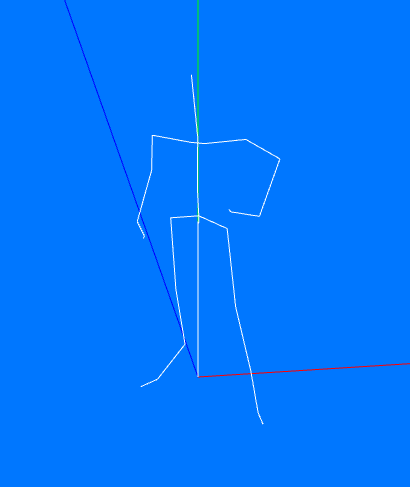

# GR2 Format Specification

GR2 files contain 3D models and skeletons stored in the proprietary [Granny3D](http://www.radgametools.com/granny.html) format. They consist of a physical (data storage) and logical (animated 3D model resources) layer.

This article only covers the files used in Gravity's RO client and does not aim to be a comprehensive resource for all possible variants and versions of Granny3D files.

## Prerequisites

Before learning about Granny3D files (as used in RO), you'll probably want to read up on a few things first.

For the data storage layer, a basic idea of the following is recommended:

* [Endianness](https://en.wikipedia.org/wiki/Endianness), a term that describes the architecture-dependant byte order of data
* [Marshalling](https://en.wikipedia.org/wiki/Marshalling_(computer_science)) can be employed to store data in an architecture-independent fashion
* [The Wikipedia article on Data Compression](https://en.wikipedia.org/wiki/Data_compression), for an intro to compression algorithms

If your interest lies with the 3D models they contain, give these a read first:

* The simpler [RSM](RSM.MD) format description, which uses keyframed animations directly
* [Skeletal animation](https://en.wikipedia.org/wiki/Skeletal_animation), a technique for animating 3D models via "bones" and "weights"
* [B-Splines](https://en.wikipedia.org/wiki/B-spline#Computer-aided_design_and_computer_graphics), a way of compactly storing animation data as mathematical curves

## Overview

GR2 files are used very sparsely in RO, and appear to be a (failed) experiment that took place late in the game's development (2003): They are only used to represent WOE Guardians, the Emperium as seen during WOE, castle flags, and treasure boxes. They also contain an unfinished version of what looks to be a 3D player model (skeleton and textures only).

There are two "types" of Granny3D files used in RO: The model and idle pose of each 3D actor and can be found in files located in the ``data/model/3dmob`` directory, while the others each store a skeleton for another pose and are found in ``data/model/3dmob_bone``.

Unlike the custom formats used in RO, Granny3D files cannot as easily be deserialized. This is because they use a proprietary compression algorithm called [Oodle](http://www.radgametools.com/oodle.htm), which comes in many different versions and is (unfortunately) not widely supported by existing open-source tools.

Each Granny file encodes a hierarchy of objects and some metadata, with all data being stored in containers called sections. The compression is applied to (some of) the data sections, while the data stored inside, like textures and animations, can also be compressed (potentially using a different algorithm). This makes processing them somewhat difficult.

There are ways to get at the data, of course, but they generally rely on specific format conversion (such as a GR2-to-DAE converter that I've seen) or may not be fully compatible with all possible GR2 versions (various open source projects for other games come to mind).

Due to this logical separation of data and representation, which makes the format highly flexible, a number of pre-processing steps are needed before the data itself can be accessed.

## Pre-Processing Phases

It appears there are multiple phases involved in restoring the structure of a Granny file:

1. Parsing of the headers and section metadata that describes the physical layout
2. Decompressing any compressed section buffer areas based on the section metadata
3. Resolving virtual pointers present in the data (educated guess; this needs confirmation)
4. Restoring hardware-dependant pointers based on the machine's architecture
5. Loading of the restored sections to create a "tree" of nodes as in-memory structure
6. Navigating this tree, starting from the root node, to access the actual data

## Features

Granny files can store arbitrary data, but in the case of RO they alway seem to follow a relatively primitive "standard" format. In particular, they don't appear to extend the basic Granny file format with custom data types. This means only some of the vast Granny3D feature set is used, the relevant portions of which should be described here.

### Mixed Marshalling

Going by what's been implemented in various open-source decompressor tools, the format allows storing data in an architecture-dependent form. This may necessitate a preprocessing step where it's updated for the current computer architecture (to restore the endianness).

It seems that this feature is indeed used by some of the files (e.g., ``aguardian90_8.gr2`` features 4 mixed marshalling blocks). I haven't looked into the specifics as OSS tools exist that will handle the de-marshalling process and I therefore consider it a "solved problem".

### Compression

The compression algorithm used for the compressed data sections is called Oodle0 and (from what I can tell) is an ancient, and almost certainly inferior, version of the same suite of compression algorithms still in use today.

In the compiled ``granny2.dll`` we find this string message that indicates it's now deprecated:

As far as the algorithm itself goes, the people at RAD have published many articles about their work on compression algorithms. Since I'm not an expert in data compression that, alongside some independent research, is the only source providing details about the design:

From what I can gather Oodle(0) uses [arithmetic coding]( https://en.wikipedia.org/wiki/Arithmetic_coding) with an [adaptive probabilistic model](https://en.wikipedia.org/wiki/Adaptive_coding) to predict the input stream while encoding, with the symbols being stored in a [Huffman-encoded](https://en.wikipedia.org/wiki/Huffman_coding) table. This means it's a variation on the standard [Lempel-Ziv](https://en.wikipedia.org/wiki/LZ77_and_LZ78) class of algorithms.

Some of the section data seems to consist of compressed data using different schemes, which (I think) are stored in separate sections without section compression, which does make sense. Examples for these are textures using the Bink texture format, and animation curves.

Since there are converter tools that will transparently deal with all of this, I haven't spent more time on researching the implementation details of the algorithm (beyond the basics).

### Sections

Granny files consist of multiple buffer areas that the decompression needs to be applied to individually before a proper and more useful Granny File structure can be obtained.

Not all of these are using compression; it seems like the assets are categorized, so some classes of assets that are already compressed (e.g., textures) don't require it and are stored in an uncompressed section that can be read directly using the offsets from the header.

I'm guessing that they are also grouped by their intended use case, since this design allows for loading only certain sections and reduce memory usage if the others aren't needed.

Once all sections have been decompressed, the result is a representation of the actual 3D model, which can be accessed to retrieve the stored geometry, textures, and animations.

## Layout

I have verified that all 21 GR2 files in the RO client use version 6 of the Granny file format.

| Field | Offset | Size | Type | Description and notes              |
| :-----: | :------: | :----: | :-----: | :---------------------------: |
| Header | 0 | 352 bytes | struct | The Granny File header structure (see below) |
| Sections | 352 | variable | binary | Compressed Granny File data, split into multiple parts |

The decompressed sections need to be relocated; it looks as though they are simply appended at the end of the header section:  The ``relocationOffset`` is always ``352``, which is the length of the header structure.

### Granny Header Structure

While the header clearly allows for flexible structures, in Ragnarok's GR2 files the size is fixed:

| Field | Offset | Size | Type | Description and notes |
| :-----: | :------: | :----: | :-----: | :---------------------------: |
| Signature  |   0    | 16 Bytes | binary | Always ``B8 67 B0 CA F8 6D B1 0F 84 72 8C 7E 5E 19 00 1E``               |
| Header Size | 16 | 4 Bytes | uint32 | Always ``352`` (decimal) |
| Compression Flag | 20 | 4 Bytes | uint32 | Always ``0`` (no compression) |
| Unknown | 24 | 4 Bytes | ? | Unused (probably) since it's always zero |
| Unknown | 28 | 4 Bytes | ? | Unused (probably) since it's always zero |
| Version | 32 | 4 Bytes | uint32 | The Granny File version (always ``6``) |
| File Size | 36 | 4 Bytes | uint32 | The total file size in bytes |
| Checksum | 40 | 4 Bytes | uint32 | A CRC checksum over the file contents |
| Section Offset | 44 | 4 Bytes | uint32 | Where the sections begin (always ``56``) |
| Section Count | 48 | 4 Bytes | uint32 | Number of sections (always ``6``) |
| Root Node Type | 56 | 8 Bytes | struct | Points to a definition of the top-level node object's type |
| Root Node Object | 64 | 8 Bytes | struct | Points to the top-level node object in the data tree |
| User Tag | 68 | 4 Bytes | uint32 | Always ``0F 00 00 80`` |
| User Data | 72 | 16 Bytes | ? | Unused (probably) since it's always zero |
| Section Headers | 88 | 264 Bytes | struct | ``44`` Bytes per section (here: ``6 * 28 = 264``)|

It should be noted that the "header size" includes the section metadata, which I've listed separately here to make it easier to survey at a glance. That is to say, ``352`` bytes is the length from the beginning of the file to the actual section data and *not* just to the section headers.

### Section Reference Structure

Objects reference the decompressed section buffer area using this simple format:

| Field | Offset | Size | Type | Description and notes |
| :-----: | :------: | :----: | :-----: | :---------------------------: |
| Index | 0 | 4 Bytes | uint32 | The index of the section containing this object |
| Offset | 4 | 4 Bytes | uint32 | Where the object is located inside the section |

This serves as a "pointer" to the buffer area and can be used to read data without having to re-arrange the entire file in memory (after the decompression and demarshalling steps).

### Section Headers Structure

| Field | Offset | Size | Type | Description and notes |
| :-----: | :------: | :----: | :-----: | :---------------------------: |
| Compression Mode | 0 | 4 Bytes | uint32 | ``0`` if uncompressed, ``1`` for Oodle0 |
| Section Offset | 4 | 4 Bytes | uint32 | After how many bytes in the file the section starts |
| Compressed Size | 8 | 4 Bytes | uint32 | After how many bytes the section ends (when compressed) |
| Decompressed Size | 12 | 4 Bytes | uint32 | How large the section is after decompressing it |
| Alignment Size | 16 | 4 Bytes | uint32 | Used for packing the data on hardware-aligned boundaries (?) |
| Stop 0 | 20 | 4 Bytes | uint32 | "Compressor stop 0" - Oodle0 parameter (?) |
| Stop 1 | 24 | 4 Bytes | uint32 | "Compressor stop 1"  - Oodle0 parameter (?) |
| Relocation Header | 28 | 8 Bytes | struct | Used to restore virtual pointers to an intermediate, hardware-dependant form (?) |
| Marshalling Header | 32 | 8 Bytes | struct | Used to restore the fixed pointers to their final, hardware-dependant form (?) |

It looks like the section metadata covers the layout and size of the buffer area, as well as the configuration data for all preprocessing steps needed to restore the data in its original form.

### Relocation Headers

| Field | Offset | Size | Type | Description and notes |
| :-----: | :------: | :----: | :-----: | :---------------------------: |
| Relocation Offset | 0 | 4 Bytes | uint32 | Where the relocation data is stored in the section |
| Relocation Count | 4 | 4 Bytes | uint32 | How many relocation data sets (?) are stored at this location |

If I understand this correctly, it's used to "relocate" references  (pointers) to the stored data. This would mean "virtual" pointers are being stored, possibly to save space or to abstract away hardware architecture details. They would then need to be "resolved" in a separate step (the "demarshalling step") before the data can actually be used?

More research is needed on this topic.

### Marshalling Headers Structure

| Field | Offset | Size | Type | Description and notes |
| :-----: | :------: | :----: | :-----: | :---------------------------: |
| Marshalling Data Offset | 36 | 4 Bytes | uint32 | Where the marshalling data is stored in the section |
| Marshalling Block Count | 40 | 4 Bytes | uint32 | How many marshalling data sets (?) are stored at this location |

After the virtual references have been resolved, the hardware-dependant pointer layout would have to be restored? After this step, the final representation should be available.

More research is needed to confirm that this is what the preprocessing steps actually do.

### Compressed Section Buffer Structure

The size is given by the ``compressedSize`` value of the respective section header. Sections are concatenated one after the other and can be accessed using the Section Reference directly.

### Decompressed Section Buffer Structure

Once all sections are decompressed, their data can be read by following the Root Node Object offset stored in the Granny file header. What you'll find inside depends on the file and format used, which could be entirely arbitrary data. What's present in RO files is listed below.

## Contents

While the above dealt with the Granny file format, the *actually* interesting parts are the contents of the individual data sections, i.e., the 3D models used for WOE Guardians, etc.

The following deals with their structure and is assuming you've used one of the available tools to get at them in the first place, as you won't be able to see what's inside the compressed buffer areas otherwise.

## Decompressed File Structure

### Contents of the Data Tree

The processed buffer area contains a hierarchy of objects used to represent the 3D model actor. In RO, each of the Granny files contains exactly **one** of the following:

* An abstract 3D model object that acts as a container (root node)
* A single skeleton, which is linked to the model, and consists of multiple bones
* A single animation container that describes the motion of the bones for this skeleton

The *base model* (as defined above) **additionally** contains shared assets for the model:

* Several meshes that contain the geometry of the 3D model's "skin"
* Compressed textures that are mapped to those meshes

The secondary models don't contain all the data required to render the model. As such, I suspect they are loaded separately and combined to form a cohesive whole with all of the relevant poses for the given model actor, which can then be animated by swapping the "active" skeleton to the one assigned to its current pose. Geometry and textures are shared.

All files also contain *material* data, which describes the material (shader) settings used by the exporter (3DS Max) that the artist used to create the model. Some of the materials refer to textures (if present), but otherwise they're just shader properties that probably might not be useful unless you want to import them in a modelling tool and replicate the exact rendition.

The following table gives an overview of all the base and auxiliary pose models:

| Model ID | Creature | Base Model (Idle Pose) | Attack Pose | Flinch Pose | Death Pose | Walk Pose |
| :---: | :---: | :---: | :---: | :---: | :---: | :---: |
| 0 | Emperium | ``empelium90_0.gr2`` | --- | --- | --- | --- |
| 1 | Guild Standard | ``guildflag90_1.gr2`` | ``1_attack.gr2`` (see below) | --- | --- | --- |
| 2 | Treasure Box | ``treasurebox_2`` | --- | ``2_damage.gr2`` | ``2_dead.gr2`` | --- |
| 7 | Knight Guardian | ``kguardian90_7.gr2`` | ``7_attack.gr2`` | ``7_damage.gr2`` | ``7_dead.gr2`` | ``7_move.gr2`` |
| 8 | Bow Guardian  |``aguardian90_8.gr2`` | ``8_attack.gr2`` | ``8_damage.gr2`` | ``8_dead.gr2`` | ``8_move.gr2`` |
| 9 | Sword Guardian | ``sguardian90_9.gr2`` | ``9_attack.gr2`` | ``9_damage.gr2`` | ``9_dead.gr2`` | ``9_move.gr2`` |

The astute observer will notice that the guild flag appears to have an attack pose. While that sounds hilarious in theory, the skeleton contained in it is clearly not compatible with the guild flag's model: It uses different bones and even includes textures, but no geometry.

Going by the animation and texture names, it rather looks like a prototype of a player character (novice) remade as 3D model, though why it was left in the game files isn't clear.

### Models

All models are assigned exactly one skeleton, and a transformation matrix that (I think) may describe its offset position in the object's local coordinate system.

#### Guild Flags

The guild flag model features a special "placeholder guild emblem" texture that is never displayed in the game. From the looks of it, this texture is simply replaced by the guild emblem assigned to it. If no emblem needs to be rendered, the placeholder remains hidden.

Interestingly, the placeholder texture is only 16 pixels in size (both width and height), which makes it even smaller than the regular guild emblems (24 pixels in size).

Compatible guild emblem textures can, for example, be created by decompressing [EBM](EBM.MD) files.

### Skeletons

Each skeleton contains (usually) 32 bones and a unique identifier. That's it.

Due to the extremely low bone count, they look pretty... *bare-bones* (ha...ha..):

*Pictured: The actual skeleton of a [Sword Guardian](https://file5s.ratemyserver.net/mobs/1829.gif) unit*

Skeletons aren't really a physical object that needs rendering; they mostly serve as a container for the hierarchy of transformation matrices represented by the bones.

### Bones

Bones are another "virtual" object, serving solely as an abstraction for the transformations used to animate the visible geometry. The "skeleton" represented by them, defines a set of points ("bones") that move independently when animated, and by "linking" (binding) a mesh to these points it follows these movements, by applying the same transformations.

The standard approach to skeletal animation is to "bind" the meshes on a per-vertex basis to any number of "bones", so that it's matrix describes how all connected vertices need to be transformed (for a given animation keyframe). There are usually multiple "influences" for each vertex, but in the case of RO each vertex is only influenced by exactly one bone.

All bones have a similarly unique (for the skeleton, not across models) identifier. They're parented to another bone (or none if they're the root bone), and offset with a set of transformation matrices that describe the bone's position in object-local space. These are decomposed and stored as a separate matrix for translation, rotation and scaling.

The scale matrix seems to only support mirroring the Y component (mirror alongside X axis) and no other scaling seems to be used, i.e. it's mostly an identity matrix except for a few cases where bones are mirrored and the ``1`` in the 2nd row becomes a ``-1``  instead (?).

From what I can tell, this reflection alongside the Y axis has no visible impact, but since I'm unsure how the bones are supposed to be scaled that might just be my mistaken interpretation. Either way, it can't have much of an effect even if I did get it wrong.

One last thing about the root bone... There's actually two of them:

* A "synthetic" root bone is used to steer the model actor's movement and orientation
* A "natural" root bone is parented to this and controls the actual hierarchy of bones

In practice, this only means that one can move the entire model by changing the synthetic root bone, and separate the animation of the character's pose from this world-space movement. Since the existing animations are already designed in this manner, both bones can be treated just like any other part of the skeleton to compose the final transform.

### Spline Animation

Animations are stored as curve data, represented by base splines (b-splines).

This means they are given as a set of points (usually called *knots* or *knot values*) which represent time as points on the temporal axis, and multi-dimensional vectors called *control points* or *controls* that approximately describe the curve at a given point.

In order to compute the transformation of each individual bone at a given point in time, the curve must be evaluated ("sampled"), which means setting the knot value to the desired time offset and computing the resulting control point. This is all handled by the Granny3D library in the RO client (or so I would assume), but it can be replicated via a keyframed animation that simply stores a sufficiently fine-grained sample as its keyframe and target value.

Curves might also be multidimensional, with the degree referring to the dimension of the vectors used to represent its data. The animation vectors are again separated into the three base types of translation, rotation, and scale expressed as 3D vector to be added, 4D rotation quaternion, and a 3x3 scale/shear matrix, respectively.

Any animated value overrides the bone's rest pose, i.e., the animation is not additive.

### Textures

Each base model contains one diffuse texture per mesh. There's some other material data, added by 3DS Max (modeling tool that the authors used), but I don't think it's actually used in the game. Trying to make use of it didn't seem to have any visible effect in my testing.

Auxiliary pose models have no textures, as they are combined with the base model in order to generate the final rendition and the base model already includes all of the geometry.

## See also

There are various open source projects providing info on Granny files:

* [https://github.com/arves100/Granny2-research/wiki/File-Format-Documentation](https://github.com/arves100/Granny2-research/wiki/File-Format-Documentation)
* [https://github.com/Karbust/gr2decode](https://github.com/Karbust/gr2decode)
* https://github.com/herenow/gr2-web
* https://github.com/Norbyte/lslib/

Some information about Oodle (from the people at RAD) can be found here:

* [http://www.radgametools.com/oodle.htm](http://www.radgametools.com/oodle.htm)
* [http://www.radgametools.com/oodlecompressors.htm](http://www.radgametools.com/oodlecompressors.htm
)

Lastly, here's a description of the synthetic root bone concept and how it's used:

* [http://hewiki.heroengine.com/wiki/Synthetic_Root_Bone](http://hewiki.heroengine.com/wiki/Synthetic_Root_Bone)
* [http://hewiki.heroengine.com/wiki/Character_Animation_Movement](http://hewiki.heroengine.com/wiki/Character_Animation_Movement)
