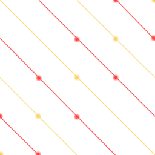
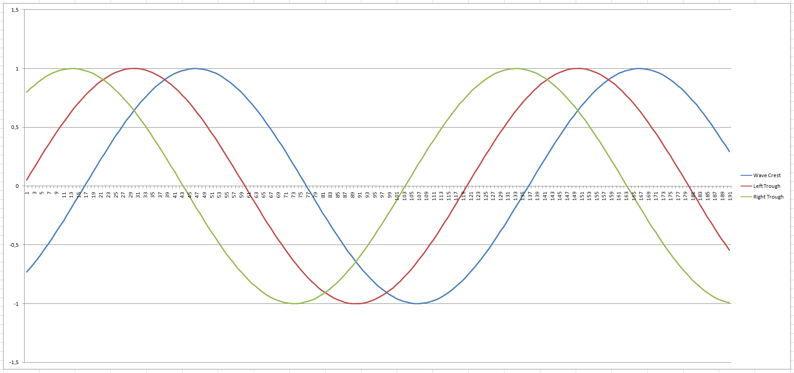
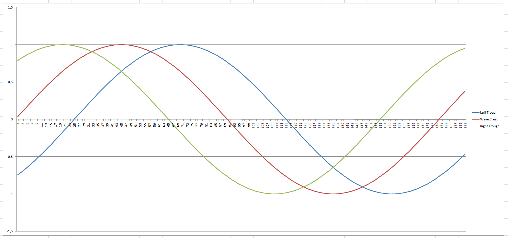
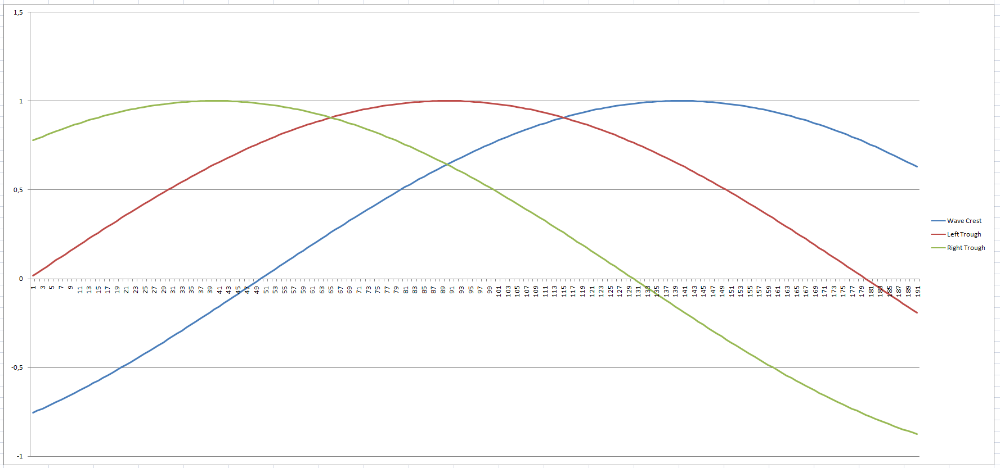
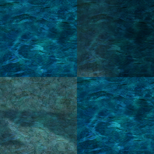

# RSW Format Specification

## Overview

RSW files essentially define the rendered scene for a given map. They include information about:

* The map's water plane (in older versions)
* Light sources and global illumination
* Environmental audio sources
* 3D models (architecture)
* Particle effect emitters
* The boundaries of the map's coordinate system (?)
* A scene graph-like representation of the object hierarchy (tree of bounding boxes)

## Prerequisites

In order to understand the RSW file format, some familiarity with the following concepts is recommended:

* [Bounding Boxes](https://en.wikipedia.org/wiki/Minimum_bounding_box), which are often used for collision detection and [frustrum culling](https://en.wikipedia.org/wiki/Hidden-surface_determination)
* [Quad Trees](https://en.wikipedia.org/wiki/Quadtree#Region_quadtree), a data structure that is here used for the purposes of culling objects from the scene
* [Particle systems](https://en.wikipedia.org/wiki/Particle_system), since particle emitters are frequently encountered in RSW files

If you want to understand the water plane's wave animations, try these links:

* You'll need a decent understanding of [waveforms](https://en.wikipedia.org/wiki/Waveform), specifically [sine curves](https://en.wikipedia.org/wiki/Sine_wave) and the [unit circle](https://en.wikipedia.org/wiki/Unit_circle#Trigonometric_functions_on_the_unit_circle)
* Some other terms may also pop up in this article: [Phase shift](https://en.wikipedia.org/wiki/Phase_(waves)#Phase_shift), [amplitude](https://en.wikipedia.org/wiki/Amplitude), and [wavelength](https://en.wikipedia.org/wiki/Wavelength#Sinusoidal_waves)
* It would certainly help to know about keyframe animations and sampling (can't find a good link)

## The Water Plane

In the most commonly-used versions of the format, information about the map's water can be found. This is used to build a special "water plane" mesh, the vertices of which are animated according to a waveform curve in order to simulate waves, which are always tied to the ground mesh's geometry.

It should be noted that there is no actual fluid simulation or wind effect, or anything resembling a typical physics engine being used in RO; the systems are far more primitive and probably hand-rolled.

As of the latest version, this information is no longer present. It is instead found in the maps' GND file.

There's also a secondary "texture cycling animation", which simply replaces the texture image for each water surface with the next one, similar to how sprites are animated by cycling through a texture atlas.

### Water Types

Each map has exactly one assigned "water type". These simply define what texture to use and provide the prefix to the water texture's file name, which is appended with the animation frame ID to determine which of the individual frames to display, while cycling through all 32 frames.

Not all of them are obviously water; there's also some "mud" and "lava" textures that use the same mechanism (described below) to animate.

### Texture Cycling

A moving water surface is simulated by increasing a cycling counter each frame and updating the water mesh's texture after it has been displayed for a sufficient duration, with texture indices cycling from 0 to 31. This number appears to be fixed, as all water types have exactly 32 frames.

A full cycle then takes ``3 * 32 = 96 frames / (60 frames / second) = 1.6 seconds`` at the default cycling speed of ``3``, which is also set in the map's RSW file, assuming a fixed framerate of 60 FPS (which is clearly what they were counting on). I'm guessing this all would break down if the FPS  drop.

### Ground Tiles and the Water Plane

The water plane itself appears to not cover the entire map area, as one would expect from a naive approach. Instead, each visible ground tile (GND cube's TOP surface) is assigned a "water vertex", which is the position of the water plane for this corner of the tile. These vertices effectively form the water plane described above; which isn't necessarily a continuous surface.

The X and Z coordinates are always pinned to the tile's X and Z coordinates, while the Y coordinate is used to define the water level at this corner of the tile. If the water is still, all four corners will be at the same height, which is exactly the water level as defined in the map's RSW file.

### Wave Cycles

If there is a wave effect, the various wave parameters will be used to simulate physical waves in the following manner:

* The "wind" is thought to always blow in direction (1,1), meaning from bottom left to top right (from southwest to northeast), in map coordinates, i.e. (x, z)
* This means that the wave will hit the ground tile in this same direction, which is "faked" by setting the top left and bottom right corners to the same height and the bottom left and top right to a different one, each corresponding to the wave height at the respective time in the wave cycle
* Calculate the height of the wave [crest and trough](https://en.wikipedia.org/wiki/Crest_and_trough) and map them to the tile's corners
* What I call the "left" trough is [phase-shifted](https://upload.wikimedia.org/wikipedia/commons/9/92/Phase_shifter_using_IQ_modulator.gif) to the left of the crest, the "right" trough to the right
* As the frames iterate through the wave cycle, the vertex heights are modified to display the water mesh's vertices in a "wavy" pattern

### Animation Sampling Basics

This simulation updates every frame (so ideally, 60 times per second?). It is not triggered via a timer, so variances in frame rate should affect the speed of wave animations greatly.

Each update will increase the "time" of the wave cycle by a small, fixed amount, until the full cycle has ran its course and is reset. Subsequently, the "water vertices" are updated, altering their height at each visible tile only.

What tiles are visible appears to be determined by the same mechanism used to cull objects from the scene, by utilizing the quad tree of regions and their bounding boxes, as defined in the GND file.

### Waveform Sampling Algorithm

The computation itself is a bit involved, but here is essentially how it works:

1. Compute the wave sampling offset ("animation frame index")
2. Compute the relative offsets of the wave troughs from the crest
3. Map the troughs and crest to the corners of each ground tile, accounting for its map position
4. Sample a sine curve at this offset to calculate the surface height at the crest and troughs
5. Scale the offsets and account for the plane's water level to determine the final height

To help visualize this, one can imagine a repeating wave pattern moving over the water surface, in the implied wind direction of (1, 1), i.e. north-east, with each trough and crest being exactly one tile apart:

*Pictured: A testament to my incredible graphs editing skills (waves advance in direction north-east)*

The tiles are implied and form a single GND surface (4x4 GAT tiles):

As the imagined wind blows (the wave animation cycle proceeds), the troughs and crests of the waves (red and orange lines, respectively) move towards the north-east and the water vertices are deformed at the tile corners according to the sampled height value. You'll have to imagine the waves in my illustration since this is all terribly low-budget, but I'm sure you'll see the pattern ingame this way.

If that wasn't exactly clear, and I'm almost certain it wasn't, I recommend checking out some ingame maps and observing the water plane's movement as it interfaces with the landmass.

In excruciating detail, the algorithm would look something like this (not sure if this actually helps...):

* Compute the wave cycle offset, as coordinates on the unit circle (in degrees)
* Starting at zero, compute the next sampling offset for the wave crest by adding the phase offset
* This happens once per frame (60 times per second?); imagine a clock ticking once per frame
* With each "tick" of the clock, the offset moves around the unit circle
* Whenever the animation loops around (reaches 180 degree), simply reset to -180 degree
* Offset this by the position (in map coordinates) of the GAT tile the water vertex is assigned to
* Additionally, phase-shift the trough offsets to move them left/right of the crest
* This can be imagined as two additional hands of the clock (left and right of the original one)
* Modulate a sine wave with the parameters from the RSW file and the above cycle offsets
* This is again computed separately for each of the four corners of the GAT tile
* During the above step, the crest is mapped to the bottom-right and top-left corners
* The left trough is mapped to the bottom-left corner, with an offset of -1
* The right trough is mapped to the top-right corner, with an offset of 1
* Lastly, the final phase shift is obtained by factoring in the surface curvature (from the RSW)
* The curvature angle therefore acts as an amplifier to increase the phase shift (if nonzero)
* If you now "unwrap" the unit circle into a line from -180 to 180, take the offsets as x-values
* Multiply in the phase shift, add the tile position offsets and sample a standard sine curve
* FInally, multiply by the amplitude parameter (scaling factor) to determine the wave's height
* The resulting height values are the final offsets of the wave's crest and both troughs at the corner
* Those sampled height offsets are added to the water plane's Y-offset (the baseline water level)

All of this only applies to maps that actually have a wave animations. When the waveform amplitude (local rate of change per sampled interval) is zero, there is no animation and the water plane's surface remains still, with the height simply being the water level (wave offset is zero).

### Waveform Visualization

Since this is all very difficult to understand without visualizing  the waveforms and trying out different values, I've prepared a spreadsheet you can play around with: [Download it here](Assets/WaveCycleVisualizationSheet.xlsx) and give it a try!

PS: Requires MS Excel :( I didn't think to use Google Sheets or LibreOffice in time, so here we are.

*Disclaimer: I made this only for myself and didn't originally intend to publish it, but then figured I might as well, so don't expect too much. Also, yes, I know git wasn't made to store binary files, but this repository shouldn't be missing anything of relevance so I added it anyway.*

To help illustrate the effect of adjusting the various waveform parameters and their impact on the computed water surface over time, here's some graphs (made with the above spreadsheet):

*Pictured: Surface curvature over time for ``alberta.rsw`` (medium-sized waves are repeating every 2 seconds)*

*Pictured: Surface curvature over time for ``comodo.rsw`` (large waves are cycling every 3 seconds)*

*Pictured: Surface curvature over time for ``aldebaran.rsw`` (the water barely moves; each cycle takes 6 seconds)*

It should be noted that the above graphs depict *only* the curvature, and not the final offset (height of the water plane's vertices). It is used as an input in the final step of the computation, as described above, but the water surface closely mirrors the sine curve as it's only scaled by the amplitude parameter afterwards.

### Renewal Water Changes

As mentioned, in the latest (Renewal-only) RSW and GND versions there have been some significant changes. For details, check out the [GND specification](GND.MD), which includes my findings on the matter.

In terms of wave cycles, I don't believe the fundamentals have changed. I'm assuming the wave animation mechanism simply extends to each of the water planes assigned to a map, i.e., there would be several animations running in parallel (if they aren't all identical).

All of this still requires further research as it can't easily be verified without access to the kRO servers.

### Transparency

Since the terrain beneath the water plane is always shining through, I'm guessing there's some transparency being used for the water planes. It's hard to tell how it works exactly, but my "best guess" estimate based on manual testing is that it could be around a 50% opacity (alpha value of ``0.5``):

*Pictured: Overlaying water textures with zero and 50% transparency, respectively*

More testing needs to be done to verify this, particularly in combination with the wave animations.

### Environmental Light Influences

It looks like the environmental light may also influence the color of the water plane somehow. This is mostly noticeable when it's very dark, such as in the case of ``mag_dun01``: The "water" (lava) texture is quite bright, but the ingame rendition looks rather dim - in alignment with the rest of the scene.

If there was indeed no such influence, the texture should be as bright as the textured ground mesh surfaces, where in reality it's similar in color to the "walls" and shadows (determined by ambient light).

Therefore I'm (again, guessing here) that the ambient color of the scene light might be factored into the water plane's diffuse color, though more testing needs to be done to verify (or disprove) this.

It's quite possible this is just another artifact of them applying some sort of filter. As the colors of all third-party-renditions I've seen look noticeably off, it has been postulated that there's some magnifying (or dampening) of the lighting, e.g. a bloom filter or some other post-processing effects.
